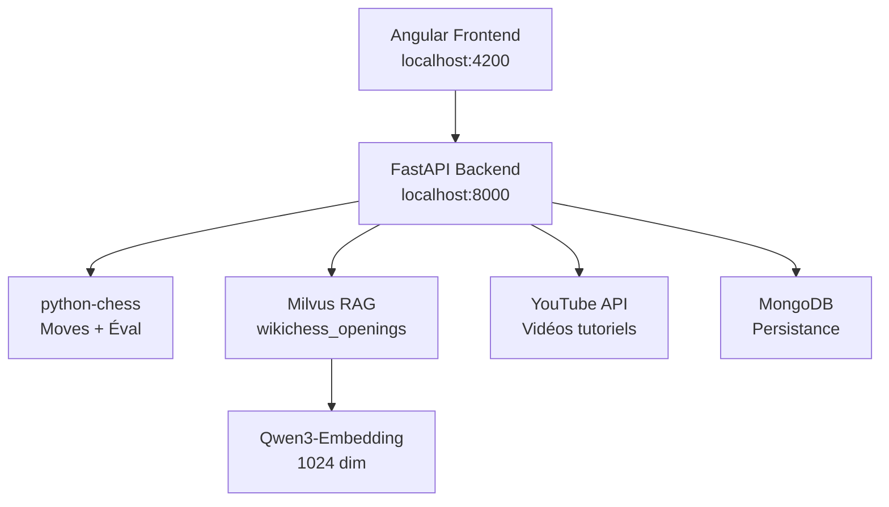

# **Chess Agent IA FFE - OCP13**


[](https://github.com/NIX3S/OCP13)

**Agent d'analyse d'échecs intelligent** avec :

- Détection d'ouvertures
- RAG Wikichess
- Tutoriels YouTube
- Stockfish
- Échiquier Angular interactif

---

## **Fonctionnalités**

| **Échiquier** | **IA Agent** | **Théorie** | **Tutoriels** |
|---------------|--------------|-------------|---------------|
| Angular 18 + `ngx-chess-board` | Détection précise des ouvertures | RAG Wikichess (47 articles) | YouTube vidéos ciblées |
| Drag & Drop des coups | Stockfish évaluation temps réel | Milvus vectorDB + Qwen3 | Cache intelligent 24h |
| FEN dynamique | Moves légaux TOP 4 | Similarité cosinus | Fallback graceful |

---

## **Stack Technique**

```

Frontend: Angular 18 + ngx-chess-board + TypeScript
Backend: FastAPI + python-chess + sentence-transformers
RAG: Milvus 2.3 + Qwen3-Embedding-0.6B (1024 dim)
Services: MongoDB + MinIO + Etcd
Cache: LRU + TTL YouTube/Wikichess
Deploy: Docker Compose full stack

````

---

## **Lancement en 1 commande**


```bash
# Clone + lance
git clone https://github.com/NIX3S/OCP13.git
cd OCP13
docker compose up --build -d

#lancement enbedding
docker ps
docker exec -it {ID_Conteneur_Backend) bash
python rag/generate_embeddings.py

#referencement milvius
docker ps
docker exec -it {ID_Conteneur_Backend) bash
python rag/init_milvius.py

# URLs
Frontend: http://localhost:4200
API Docs: http://localhost:8000/docs
Health: http://localhost:8000/healthcheck
````

---

## **Démo en action**

```
Agent IA FFE analyse 1.e4:
Ouverture: King's Pawn Game (1.e4)
Wikichess: "Ruy Lopez: 1.e4 e5 2.Cf3..." (score: 0.92)
YouTube: "King's Pawn Tutorial - GM Levy Rozman"
Éval: +0.35 (Blanc avantagé)
Meilleurs coups: e7e5, c7c5, g8f6
```

---

## **Architecture**



---

## **Endpoints API**

| Endpoint                       | Description                     | Exemple                   |
| ------------------------------ | ------------------------------- | ------------------------- |
| `GET /api/v1/analyze/{fen}`    | Analyse complète d’une position | `/analyze/rnbqkbnr...`    |
| `GET /vector-search/{opening}` | RAG Wikichess similaire         | `/vector-search/Sicilian` |
| `GET /healthcheck`             | Status des services             | Cache + YouTube           |
| `DELETE /clear-cache`          | Reset cache (dev)               | -                         |

---

## **Configuration**

```bash
# .env (optionnel)
YTB_KEY=your_youtube_api_key
MILVUS_HOST=milvus
MONGO_URL=mongodb://chess_mongo:27017
```

---

## **Performances**

* Temps réponse: < 100ms (cache)
* Wikichess: 47 articles indexés
* YouTube: TTL 24h + timeout 1.2s
* Qwen3: 1024 dim → similarité cosinus
* Chess: LRU 2048 positions

---

## **Roadmap**

* [x] Détection ouvertures précises
* [x] RAG Wikichess Milvus + Qwen3
* [x] Tutoriels YouTube intégrés
* [x] Angular échiquier drag & drop
* [ ] Stockfish WASM browser
* [ ] Multi-PGN analyse parties
* [ ] Lichess API bases de données

---

## **Licence**

```
MIT License - Open Source
© 2026 NIX3S - Chess Agent IA FFE
```

---

## **Contributors**

| GitHub                             | Rôle                         |
| ---------------------------------- | ---------------------------- |
| [@NIX3S](https://github.com/NIX3S) | Full Stack + Debug RAG + Git |

---

[](https://github.com/NIX3S/OCP13)
[](https://github.com/NIX3S/OCP13)

**Chess Agent IA FFE → Joue, Analyse, Apprends !**

```

Veux‑tu que je fasse ça ?
```
